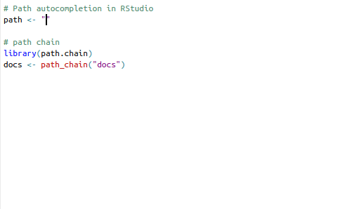

<!-- README.md is generated from README.Rmd. Please edit that file -->

# path.chain 

<!-- badges: start -->

[](https://krzjoa.github.io/path.chain/)
[](https://travis-ci.org/krzjoa/path.chain)
[](https://ci.appveyor.com/project/krzjoa/path.chain)
[](https://www.redbubble.com/i/sticker/path-chain-R-package-hex-sticker-by-krzjoa/45140988.EJUG5?asc=u)
<!-- badges: end -->

> Concise structure for chainable paths

## Installation

`path.chain` is available on CRAN, so you can install it using simply:

``` r
install.packages('path.chain')
```

Dev version is available on GitHub:

``` r
# install.packages("devtools")
devtools::install_github("krzjoa/path.chain")
```

## Example

If you are using RStudio, you know that among many excellent features of
this IDE there is a **path autocompletion**.



However, you can also meet situations, when that may be not enough. Most
of all, I mean bigger projects, where you store a complex file structure
in the **config** file. You can handle such configuration YAML file
using the library named [`config`](https://github.com/rstudio/config).
You may encounter a situation, when you’ll want to save current
directory structure in this config.

### Basic usage

``` r
library(magrittr)
library(path.chain)

# Create an example file stucture
tmp <- create_temp_dir("files")
create_sample_dir(tmp, override = TRUE)
#> [1] TRUE

# Sample structure we've already created looks as follows
fs::dir_tree(tmp)
#> /tmp/RtmpRSpDrI/files
#> ├── data
#> │   ├── example1.RData
#> │   ├── example2.RData
#> │   └── persons.csv
#> └── docs
#>     └── schema.txt

# Loading stucture
file.structure <- path_chain(tmp)
file.structure$data$example1.RData
#> [1] "files/data/example1.RData"

# Loading stucture with naming convention
file.structure <- path_chain(tmp, naming = naming_k)
file.structure$kData$kExample1
#> [1] "files/data/example1.RData"

# Saving file structure
file.structure %>% 
  as_config(root.name = "kRoot", wrap = "kDirs") %>%  # Required by `{config}` package
  yaml::write_yaml(temp_path("config.yaml"))
```

``` yaml
default:
  kDirs:
    kRoot: files/
    kData:
      kRoot: data/
      kExample1: kExample1
      kExample2: kExample2
      kPersons: kPersons
    kDocs:
      kRoot: docs/
      kSchema: kSchema
```

### Loading config file

``` r
k.dirs <- config::get("kDirs", "default", temp_path("config.yaml")) %>% 
  as_path_chain()

class(k.dirs)
#> [1] "path_chain"

k.dirs$kData$.
#> [1] "files/data/"
k.dirs$kData$kExample1
#> [1] "files/data/example1.RData"
```

### Path validation

``` r
on_path_not_exists(~ print("Path {.x} not exists"))
is_path_valid <- function(x) if (!grepl("\\.fst", x)) print("Invalid file")
on_validate_path(is_path_valid)

level2.b <- path_link("fileA.RData")
level2.a <- path_link("fileB.fst")
level1   <- path_link("data", list(level2.a = level2.a , level2.b = level2.b))
root     <- path_link("files", list(level1))

root$data$level2.a
#> [1] "Path {.x} not exists"
#> [1] "files/data/fileB.fst"
root$data$level2.b
#> [1] "Path {.x} not exists"
#> [1] "Invalid file"
#> [1] "files/data/fileA.RData"
```
